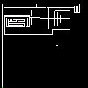
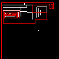
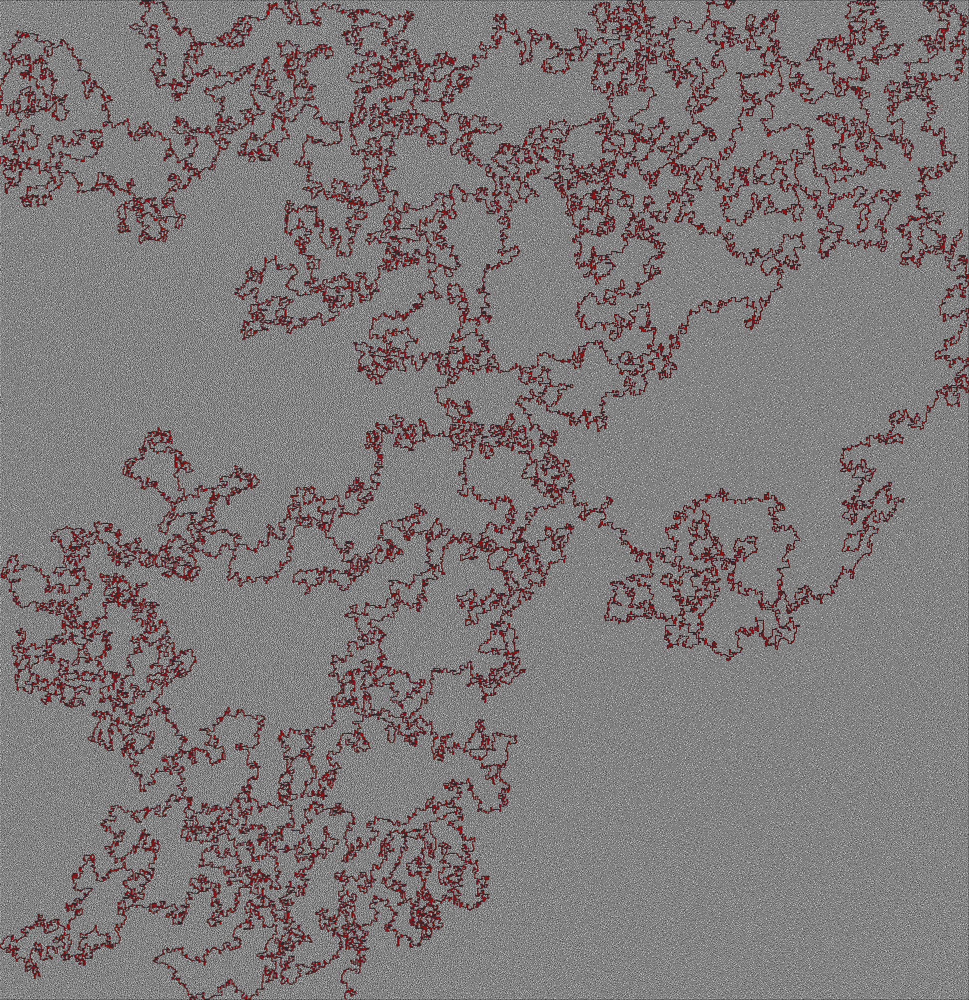

# VbPicSolver
Missing VB again so why not 

It solves mazes such as example included. works with pngs and exact colors please note its not optimised to find the best path just a path that works in a brute force style\flood

white pixle represents a empty space

Black pixle represents a wall

Green for start point

red for end point

## Example 1

 Example 1:

 Saves a result of:

## Example 2

 Example 2:

 Saves a result of:

## Example 3

 Example 3:

 Saves a result of:

