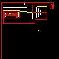
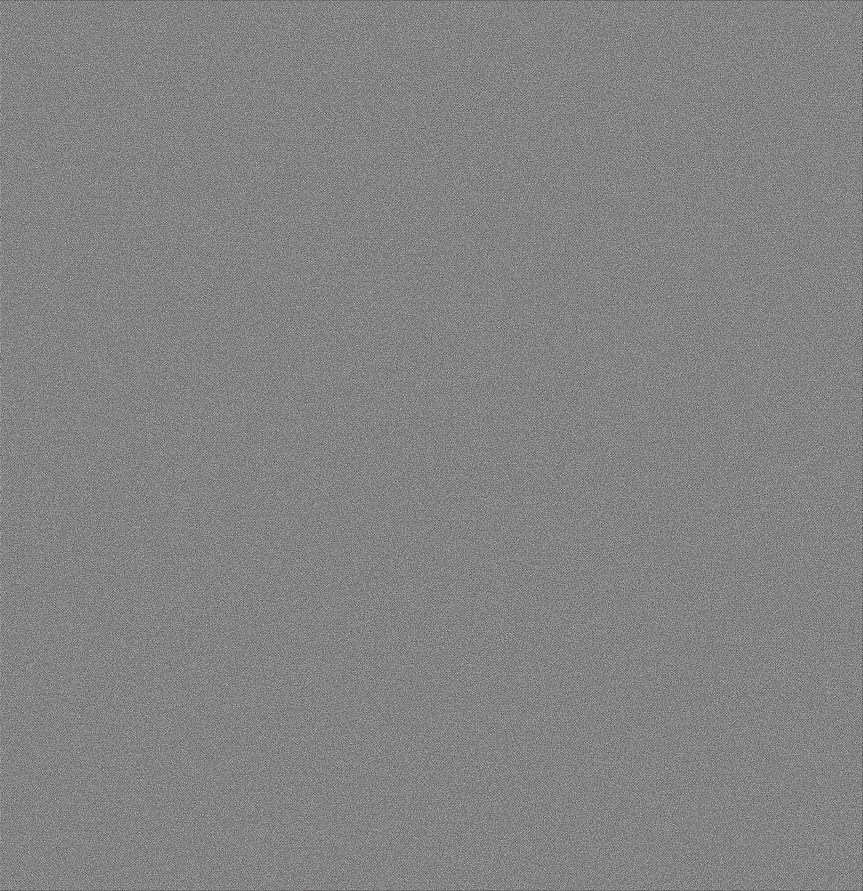
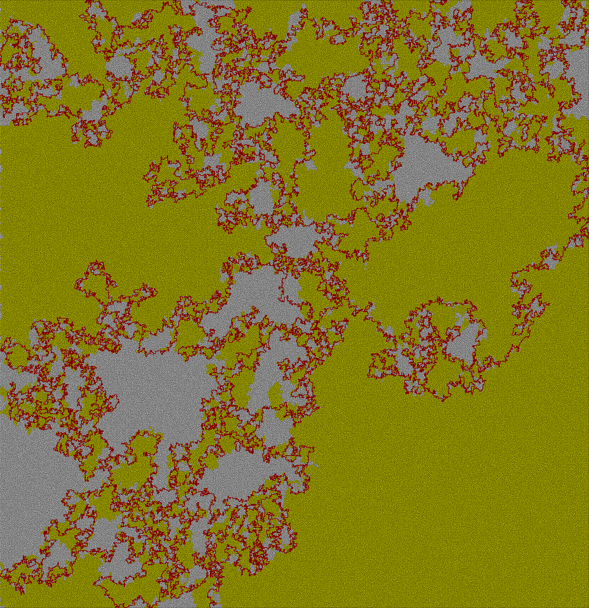

# VbPicSolver
Missing VB again so why not 

It solves mazes such as example included. works with pngs and exact colors only i.e green is 0,255,0 (RGB).

 please note its not optimised to find the best path just a path that works in a brute force style\flood 

# Pixels
* White pixle represents a empty space
* Black pixle represents a wall
* Green for start point
* Red for end point

## Example 1

 Example 1:

 Saves a result of:

 Saves result with ShowWorking flag set to true :

## Example 2

 Example 2:

 Saves a result of:

 Saves result with ShowWorking flag set to true :

## Example 3

 Example 3:

 Saves a result of:

 Saves result with ShowWorking flag set to true :

